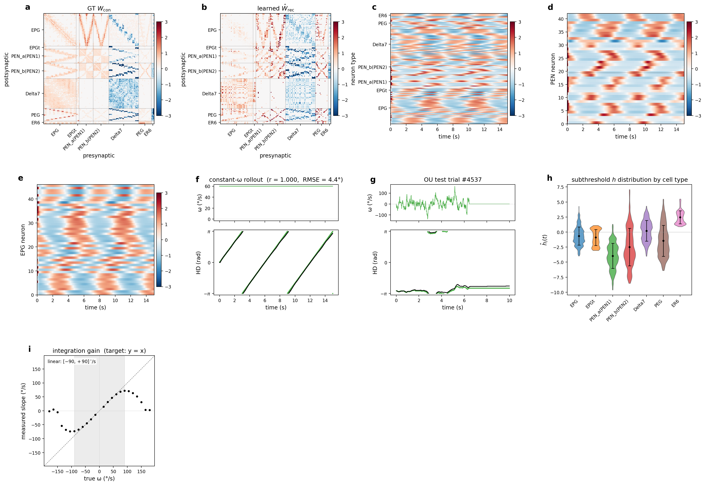
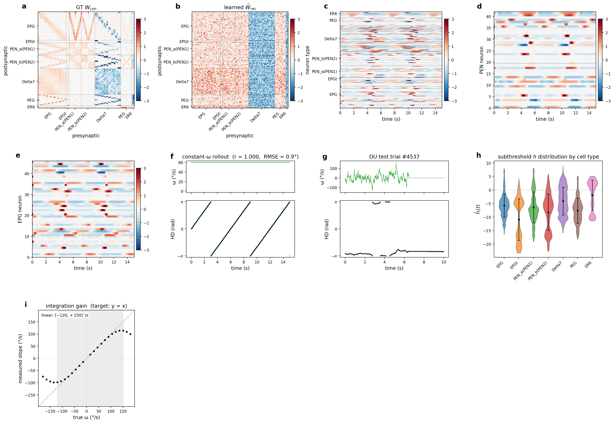
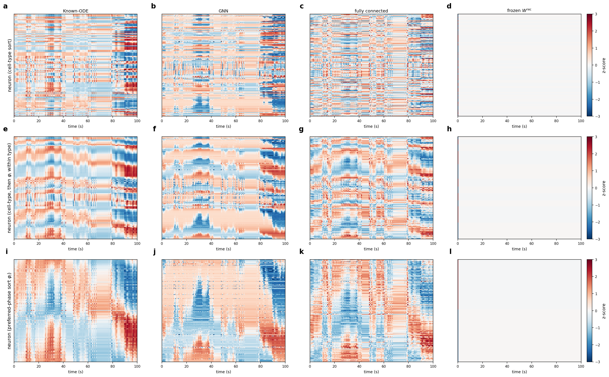

> **Abstract.** Theoretical work on emergent structure in recurrent neural
> networks almost never has a ground-truth comparison: discovered modules are
> evaluated against themselves. The *Drosophila* central complex (CX) is one of
> the rare exceptions — a complete connectome (Hulse et al. 2021) pairs with a
> known biological function (head-direction integration) and a published RNN
> model (Vafidis et al. 2022). We use this pairing to ask what optimisation of
> the path-integration task identifies when the connectome topology is given.
> Four constrained parameterisations are trained on the same input–output map
> under 10-fold cross-validation: a **Known-ODE RNN**, a **frozen-connectome
> control**, a **fully connected RNN**, and a **message-passing GNN** with
> learned neuronal signalling functions. The frozen-connectome control fails to
> reach path-integration accuracy ($p_{\mathrm{acc}} = 0.29$, 0/10 folds above
> $|r| \ge 0.9$); the fully connected RNN converges only intermittently (3/10);
> the Known-ODE RNN and the GNN converge reliably. Across folds the learned
> recurrent weights cluster more tightly with one another than with the raw
> hemibrain template, indicating that training supplies edge magnitudes the
> topology alone does not. The GNN reaches comparable behavioural performance
> through a different implementation. Thus optimising the path-integration task
> recovers the ring-attractor computation, but **not** a unique circuit
> implementation.

# The circuit

The model spans **156 central-complex neurons** across seven cell classes —
**EPG (46), EPG~t~ (4), PEN~a~ (20), PEN~b~ (22), Δ7 (42), PEG (18), ER6 (4)**.
The principal heading pathway runs from EPG dendrites in the ellipsoid body
(EB), where the activity bump is represented, to EPG axons in the protocerebral
bridge (PB), where heading is distributed to PEN, PEG and Δ7. PEN neurons
receive angular-velocity input and project back to the EB through the PB–NO
pathway, providing the rotational drive that shifts the bump; Δ7 form broad
inhibitory interactions across PB glomeruli, and PEG participate in recurrent
PB↔EB loops. Together they implement the ring-attractor dynamics underlying path
integration.

![**Anatomy of the 338 CX neurons of the path-integration circuit and the flow of heading information.** (a) 3-D skeleton render of the thirteen cell classes over PB, FB, EB, NO and bulb: the seven heading-core classes (EPG, EPG~t~, PEN~a~, PEN~b~, Δ7, PEG, ER6; 156 cells) plus the six FB columnar / vector families (PFN~d~, PFN~v~, PFN~a~, hΔB, PFR~a~, PFR~b~; 182 cells); colours identify cell types and are used consistently throughout. (b) Soma locations: cell bodies lie outside the neuropils, so the ring visible in the EB is a ring of *arborisations*, not of somata.](figures/drosophila_cx/fig_cx_anatomy_3d.png)

![**The CX path-integration connectome $W^{\mathrm{con}}$ (338-cell circuit).** Both panels share the row/column ordering: neurons sorted by the four-way functional partition of Fig. 1c/d — HD ring (amber; recurrent), PEN (blue; angular-velocity gate), PFN (orange; forward-velocity gate), vector (green; displacement readout). (a) Binary support — density 0.170, 19 470 non-zero edges out of $338^2$, with partition colour strips on the axes. (b) Signed connectome, z-scored over non-zero entries (red excitatory, blue inhibitory), same ordering. Following the Hulse-2025 preparation, Δ7 and ER6 outputs are sign-flipped (inhibitory) and ER6 amplified 5× before $W^{\mathrm{con}}$ is normalised to spectral radius 0.9.](figures/drosophila_cx/fig_connectome_summary.png)

# Methods

## Known-ODE recurrent neural network

A sign-locked discrete-time RNN whose connectivity is constrained to the
hemibrain template. Activation $\sigma$ is a sigmoid, membrane time constant
$\tau = 0.1\,$s, integration step $\Delta t = 0.01\,$s. The input
$u(t) \in \mathbb{R}^3$ carries angular velocity plus a one-frame
initial-heading cue.

$$
\tau\,\frac{d\hat{h}_i(t)}{dt} = -\hat{h}_i(t)
  + \sum_j \hat{W}^{\mathrm{rec}}_{ij}\,\sigma\big(\hat{h}_j(t)\big)
  + \sum_l \hat{W}^{\mathrm{in}}_{il}\,u_l(t) + \hat{b}_i ,
$$

$$
\hat{y}(t) = \big(\cos\hat{\theta}(t),\,\sin\hat{\theta}(t)\big)
           = \hat{W}^{\mathrm{out}}\sigma\big(\hat{h}(t)\big) + \hat{b}^{\mathrm{out}} ,
\qquad
\hat{W}^{\mathrm{rec}}_{ij} = |\hat{S}_{ij}|\,\operatorname{sign}(W^{\mathrm{con}}_{ij}) .
$$

The recurrent matrix is **sign-locked** to the template — the only trainable
recurrent quantity is the per-edge magnitude $\hat{S}$. Angular-velocity input is
gated onto the PEN sub-populations through four learnable scalars initialised
antisymmetrically across hemispheres. The objective is per-frame MSE on the
cos/sin heading readout plus connectome-prior regularisers (a per-block cosine
anchor $\mathcal{L}_{\mathrm{cos}}$, a norm-floor $\mathcal{L}_{\mathrm{nf}}$,
$\ell_1$ sparsity).

## Message-passing graph neural network

The GNN replaces the dense recurrent operator with message passing (Gilmer et
al. 2017) and does **not** hard-code the leak, firing-rate nonlinearity or
synaptic activation — these emerge from a learned drift $f_\theta$, a learned
signalling function $g_\phi$, and a per-neuron embedding $\mathbf{a}_i$:

$$
\tau\frac{d\hat{h}_i(t)}{dt} =
  f_\theta\!\Big(\hat{h}_i(t),\,\mathbf{a}_i,\,
       \sum_{j\in\mathcal{N}_i} \hat{W}_{ij}\,g_\phi\big(\hat{h}_j(t),\mathbf{a}_j\big)\Big)
  + \sum_l \hat{W}^{\mathrm{in}}_{il}\,u_l(t),
\qquad
\hat{W}_{ij} = |W_{ij}|\,\operatorname{sign}(W^{\mathrm{con}}_{ij}).
$$

$f_\theta$ and $g_\phi$ are 3-layer MLPs (width 64, ReLU). $g_\phi$ is
constrained monotonically increasing in $\hat h_j$; combined with the sign-lock
this restores Dale's law per edge without the $\pm$-sign degeneracy. The GNN
loss adds $\ell_1/\ell_2$ penalties on the MLP weights and on $W$, plus four
monotonicity/normalisation priors. Hyperparameters are tuned by an **agentic
optimisation** loop, scored by $r_{\mathrm{roll},1k}$ — the Pearson correlation
between decoded and true heading on a deterministic 1 000-step constant-$\omega$
rollout. A key methodological point: *optimisation failure is not evidence
against a mechanistic hypothesis*, so extensive closed-loop search is required
before any "model X cannot do Y" claim.

## The four conditions

Four parameterisations, trained on the same task under 10-fold cross-validation:

| # | Condition | Recurrent constraint | Converges |
|---|-----------|----------------------|-----------|
| 1 | Known-ODE RNN | topology + Dale signs fixed; per-edge magnitude learned | 10/10 |
| 2 | GNN | topology mask; learned $f_\theta, g_\phi, \mathbf{a}_i$ | 9/10 |
| 3 | Fully connected RNN | only column-wise Dale sign; dense | 3/10 |
| 4 | Frozen $W^{\mathrm{rec}}$ | $\hat{W}^{\mathrm{rec}}\equiv W^{\mathrm{con}}$ (raw) | 0/10 |

# Results: who converges

All conditions share the same path-integration task, EPG-only readout, and
10-fold cross-validation. Per condition we report the mean ± s.d. of
$|r_{\mathrm{roll},1k}|$, path-integration accuracy $p_{\mathrm{acc}}$, EPG-bump
FWHM, and constant-$\omega$ circular RMSE.

| Condition | $n_{\mathrm{conv}}/10$ | $\lvert r_{\mathrm{roll},1k}\rvert$ | $p_{\mathrm{acc}}$ | FWHM (°) | RMSE (°) |
|---|---|---|---|---|---|
| Known-ODE RNN | **10/10** | 1.000 ± 0.000 | 0.996 ± 0.002 | 44.3 ± 7.4 | 4.6 ± 2.3 |
| GNN | 9/10 | 0.930 ± 0.210 | 1.000 ± 0.000 | 41.3 ± 12.9 | 4.6 ± 3.1 |
| Fully connected RNN | 3/10 | 0.535 ± 0.360 | 0.930 ± 0.064 | 31.6 ± 9.2 | 68.9 ± 52.8 |
| Frozen $W^{\mathrm{rec}}$ | 0/10 | 0.669 ± 0.094 | 0.294 ± 0.134 | 28.3 ± 9.0 | 95.7 ± 16.3 |

: 10-fold CV summary. $n_{\mathrm{conv}}$ = folds with $|r_{\mathrm{roll},1k}|\ge0.9$. {tbl-colwidths="[34,12,18,14,11,11]"}

**The frozen-connectome control fails outright** (0/10, gain ≈ 0): the raw
hemibrain weights fix sign and topology — enough for the decoded heading to
track the right rotation *direction* — but the *magnitudes that turn this into a
1:1 integrator have to be trained*. This directly falsifies the reading that the
connectome alone carries the computation.

**Removing the topology mask collapses convergence**: with only a column-wise
Dale sign the fully connected RNN converges in just 3/10 folds. It is rejected
on reliability, not on solution quality — the 3 converged folds do form a proper
bump. The connectome's missing-edge pattern is not strictly necessary, but the
optimiser rarely discovers both the support and the magnitudes from scratch.

The **Known-ODE RNN and the GNN converge reliably** and reproduce the
ring-attractor — the GNN through a more linear integration gain (slope ≈ 1 over
±180°/s) than the Known-ODE RNN's saturating sigmoid.

# What a trained ring attractor looks like

Each "evolution" panel shows, for one fold: the GT connectome (a) and learned
$\hat{W}^{\mathrm{rec}}$ (b); whole-population, PEN and EPG kinographs over a
constant-$\omega = +60°/$s rollout (c–e); the decoded-vs-true heading on
constant-$\omega$ and held-out OU trials (f,g); the per-cell-type state
distribution (h); and the integration gain (i).

::: {.column-margin}
The 3-D voltage animations below render $\hat{h}_i(t)$ on the actual neuPrint
skeletons over a constant-$\omega$ rollout.
:::

::: {layout-ncol=2}
::: {}
**Known-ODE RNN** — the hardcoded leak/sigmoid circuit.

:::
::: {}
**Message-passing GNN** — leak and nonlinearity learned.

:::
:::

# Same behaviour, different machinery

Voltage traces and all-neuron kinographs make the contrast concrete. Under a
deterministic constant $\omega = 60°/$s (2.5 full turns) all three converged
conditions reproduce the constant-rate heading sweep with periodic bump
migrations; the frozen control shows no bump and a drifting decoded heading.

---

Continue to **[Part 2 — Identifiability & function](drosophila-degeneracy.qmd)**,
which quantifies how loosely the task constrains the weights, where the
head-direction information lives, and how degenerate the inverse problem really
is.
