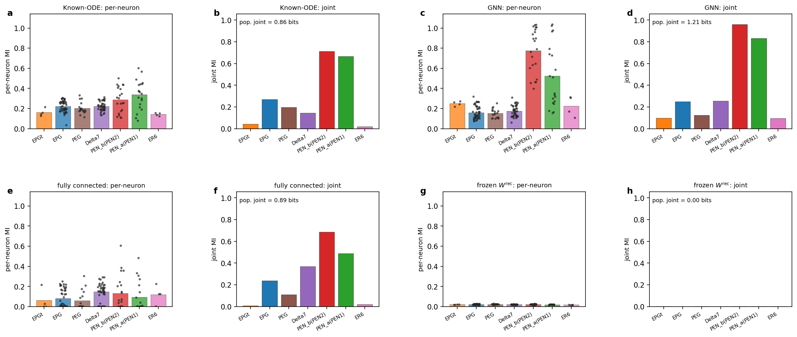

[Part 1](drosophila-cx.qmd) showed that the Known-ODE RNN and the GNN reliably
recover a ring attractor, while the frozen-connectome control fails and the
fully connected RNN converges only intermittently. This page asks the harder
question: **once a circuit performs the task, what about it is actually pinned
down?** The answer is a recurring theme — the *computation* is identifiable, the
*implementation* is not.

# Many circuits, the same activity

The task fixes only the input–output map ($\omega$ in, $\hat\theta$ out). Each of
the four trainable parameterisations was retrained over 10 cross-validation
folds. Every fold of the Known-ODE RNN and GNN converges to the behavioural
ceiling — but **not to the same weights**.

![**Comparison of the trained $\hat{W}^{\mathrm{rec}}$ across parameterisations × 10 folds.** (a) Per-condition pairwise cosine similarity over the connectome support ($W^{\mathrm{con}}$ first, then the 10 folds). Inter-fold mean: **0.663 ± 0.023** (Known-ODE), **0.502 ± 0.021** (GNN) — folds cluster more tightly with each other (and the cluster is tightest for the Known-ODE RNN) than with the raw template (≈ 0.63). (b) Per-block coefficient of variation across folds: some blocks are tightly constrained (median CV ≲ 0.5, e.g. Δ7→PEN~b~), others nearly free (CV ≳ 1, e.g. Δ7→Δ7). (c) Per-block $\log_2$ ratio of learned to connectome mean magnitude — uniformly **positive** and reproducible: training amplifies the connectome along its existing support, by a factor that varies over an order of magnitude across cell-type pairs.](figures/drosophila_cx/fig_w_rec_comparison.png)

So training supplies edge magnitudes that the topology alone does not, and those
magnitudes are only partially identifiable: the network sits in a *cluster* of
solutions, not at a point.

# The learned dynamics also differ

The GNN reaches the same behaviour with genuinely different per-neuron
machinery. Probed along a natural OU velocity rollout, the Known-ODE RNN sweeps
the full activation range — painting the linear leak $-\hat h/\tau$ and the
saturating sigmoid in both tails — while the GNN's learned drift $f_\theta$ and
signalling $g_\phi$ deviate from those canonical forms and concentrate the
operating range in a narrow band near a flat plateau.

![**Operating range of the leak/drift (left of each pair) and the firing-rate nonlinearity (right) for the four parameterisations**, OU rollout, $T=10\,000$ frames. Hexbin density of per-(neuron, time) samples; red = the static function. Row 1: the Known-ODE RNN sweeps $|\hat h| \lesssim 10$ and recovers linear leak + saturating sigmoid, while the GNN's $f_\theta$ and $g_\phi$ depart from $-\hat h/\tau$ and the canonical sigmoid. Row 2: the fully connected RNN reuses the hardcoded functions over a reshaped range; the frozen control collapses onto its resting state.](figures/drosophila_cx/fig_function_dynamics_combined_epg.png)

# Where the head-direction information lives

Mutual information (MI) between each unit's rate $r_i(t)=\sigma(\hat h_i(t))$ and
heading $\theta$ (single-neuron plug-in estimator, bits) and population joint MI
(a cross-validated logistic-regression lower bound) quantify the head-direction
code. The three trainable conditions reach a population $I_{\mathrm{pop}}$ of
**3.0–3.8 bits** — predicting a posterior heading spread
$\sigma_{\theta\mid\hat h} = \sigma_\theta\,2^{-I_{\mathrm{pop}}} \approx 7$–12°,
consistent with the measured circular RMSE — while the frozen control collapses to
≈ 0.08 bits.

![**Per-cell-type head-direction MI across the four parameterisations** (OU rollout, $n_\theta = 64$). Left columns: per-neuron MI (bars = type mean, dots = neurons); right columns: per-type joint MI with the population value annotated. The Known-ODE RNN places head-direction information on EPG, Δ7, PEG, EPG~t~ and ER6 with the PEN populations lower; the GNN carries HD on the same backbone but spreads it more evenly across types and at the highest population budget; the fully connected RNN reallocates HD onto Δ7 and ER6 at EPG's expense.](figures/drosophila_cx/fig_hd_mi_summary_nbins64.png)

| type | n | Known-ODE $\bar I_i$ / $I_{\rm joint}$ / $\rho$ | Fully conn. $\bar I_i$ / $I_{\rm joint}$ / $\rho$ | GNN $\bar I_i$ / $I_{\rm joint}$ / $\rho$ |
|---|---|---|---|---|
| EPG | 46 | 1.97 / 2.56 / 35.4 | 0.66 / 2.71 / 11.2 | 1.78 / 3.30 / 24.8 |
| EPG~t~ | 4 | 1.87 / 1.39 / 5.4 | 0.39 / 0.83 / 1.9 | 1.59 / 1.41 / 4.5 |
| PEN~a~ | 20 | 0.98 / 2.25 / 8.7 | 0.45 / 2.12 / 4.3 | 1.16 / 2.77 / 8.4 |
| PEN~b~ | 22 | 1.01 / 2.43 / 9.2 | 0.43 / 2.22 / 4.2 | 1.13 / 2.91 / 8.5 |
| Δ7 | 42 | 2.10 / 2.46 / 35.8 | 1.23 / 3.09 / 16.7 | 1.79 / 3.00 / 25.1 |
| PEG | 18 | 1.92 / 2.46 / 14.0 | 0.43 / 1.97 / 3.9 | 1.62 / 2.62 / 11.2 |
| ER6 | 4 | 1.88 / 0.93 / 8.1 | 1.28 / 1.94 / 2.6 | 1.76 / 1.46 / 4.8 |
| **all** | 156 | $I_{\mathrm{pop}}=2.96$ | $I_{\mathrm{pop}}=3.31$ | $I_{\mathrm{pop}}=3.77$ |

: Per-cell-type HD MI for the three trainable conditions. $\rho$ = within-type redundancy $\sum_i I_i / I_{\rm joint}$; the EPG block's $\rho\approx35$ means its 46 cells act as ≈ 1 effective independent encoder. {tbl-colwidths="[10,6,28,28,28]"}

The angular-velocity code is complementary: PEN~a~/PEN~b~ are the top
$\omega$-encoders in every trainable condition (a direct consequence of the
four-scalar PEN gate). Path integration accumulates this noisier per-step
velocity estimate ($\sigma_{\omega\mid\hat h}\approx16$–23°/s) into the tighter
7–12° heading posterior.

# Four functional classes (R/L/D/Z)

Following the zebrafish partition, each neuron is sorted by three scores on an
OU rollout: heading MI $\mathcal{I}_i$, readout magnitude
$\mathcal{W}_i = \lVert\hat{W}^{\mathrm{out}}_{:,i}\rVert_2$, and
angular-velocity modulation $\mathcal{O}_i$. Median splits give four classes:

$$
\begin{aligned}
i\in\mathsf{R} &\iff \mathcal{I}_i\ge\mathcal{I}^\star \;\&\; \mathcal{W}_i\ge\mathcal{W}^\star && \text{(readout-relevant bump representation)}\\
i\in\mathsf{L} &\iff \mathcal{I}_i\ge\mathcal{I}^\star \;\&\; \mathcal{W}_i<\mathcal{W}^\star && \text{(latent HD encoders, invisible to the linear decoder)}\\
i\in\mathsf{D} &\iff \mathcal{I}_i<\mathcal{I}^\star \;\&\; \mathcal{O}_i\ge\mathcal{O}^\star && \text{(angular-velocity drivers)}\\
i\in\mathsf{Z} &\iff \mathcal{I}_i<\mathcal{I}^\star \;\&\; \mathcal{O}_i<\mathcal{O}^\star && \text{(uninvolved)}
\end{aligned}
$$

| type | Known-ODE  R/L/D/Z (total) | GNN  R/L/D/Z (total) |
|---|---|---|
| EPG | 11 / 10 / 16 / 9 (46) | 13 / 15 / 6 / 12 (46) |
| EPG~t~ | 0 / 3 / 0 / 1 (4) | 0 / 0 / 3 / 1 (4) |
| PEN~a~ | 0 / 0 / 20 / 0 (20) | 0 / 3 / 14 / 3 (20) |
| PEN~b~ | 0 / 0 / 22 / 0 (22) | 0 / 0 / 21 / 1 (22) |
| PEG | 0 / 15 / 0 / 3 (18) | 0 / 9 / 4 / 5 (18) |
| Δ7 | 0 / 39 / 3 / 0 (42) | 0 / 36 / 4 / 2 (42) |
| ER6 | 0 / 0 / 0 / 4 (4) | 0 / 2 / 1 / 1 (4) |
| **total** | **11 / 67 / 61 / 17 (156)** | **13 / 65 / 53 / 25 (156)** |

: Per-cell-type R/L/D/Z breakdown (one fold each). {tbl-colwidths="[16,42,42]"}

# Tuning-curve sharpness

Each HD-coding cell ($\mathsf{R}\cup\mathsf{L}$) gets a tuning curve, a
specificity index $\mathcal{T}_i\in[0,1]$ (first-Fourier-coefficient magnitude /
$\ell_1$ size of the centred curve), and a preferred angle. The three trainable
conditions produce sharp single-peaked von-Mises bumps; the frozen control shows
flat curves and a degenerate preferred-angle histogram.

![**Tuning-curve sharpness across the four parameterisations.** Column 1: example specific (blue/green) and non-specific (grey) cells. Column 2: distribution of $\mathcal{T}_i$ with the retention cut $\mathcal{T}^\star=0.70$. Column 3: centred, unit-peak-normalised curves of retained cells (grey), across-cell mean (red), 25–75% band, and the $\ell_2$-fit von Mises $f_\star(\theta;\kappa)=\exp(\kappa(\cos\theta-1))$. Column 4: preferred-angle distribution. Frozen (bottom row): flat curves, degenerate angles.](figures/drosophila_cx/fig_cx_tuning_sharpness.png)

# Appendix A — degeneracy of the inverse problem

How many distinct $\hat{W}^{\mathrm{rec}}$ reproduce the *same* voltage
trajectories? Fixing the biases, $\tau$ and $\hat{W}^{\mathrm{in}}$ at their
trained values and rearranging the dynamics isolates each neuron's incoming
weights into a linear system $\mathbf{H}_i\mathbf{w}_i = \mathbf{b}_i$ whose null
space measures the degeneracy.

$$
\sum_{j\in\mathcal{N}_i}\hat{W}^{\mathrm{rec}}_{ij}\,\sigma\big(\hat h_j(t)\big)
= \tau\,\frac{d\hat h_i(t)}{dt} + \hat h_i(t) - \hat b_i - I_i(t),
\qquad
\dim\ker(\mathbf{H}) \approx \sum_{i=1}^{N}\max(0,\, d_i - r).
$$

Two SVD bounds disagree by more than an order of magnitude (strict per-neuron
SVD flags only 6.3% of edges as removable; a global rank-6 ring-attractor
manifold flags 90.9%), so the analysis turns to **structured** perturbations
along two candidate null partitions: per-cell-type $(i,\alpha)$ and per-unit
$(i,\alpha,\text{instance})$ — the latter following the glomerular clone
structure of Hulse et al. (2026).

![**Sparsifying $\hat{W}^{\mathrm{rec}}$ along the candidate null directions.** Top: recurrent matrices (z-scored); bottom: heading decoded from each rollout (GT light green, decoded black). (a,e) Learned matrix — GT and decoded coincide. (b,f) Per-$(i,\alpha)$ sum-preserving collapse zeroes 91.6% of edges; the bump-coding blocks lose structure and decoding only partially tracks ($r=0.60$). (c,g) Per-$(i,\alpha,\text{instance})$ collapse zeroes 50.2% and preserves more structure ($r=0.63$). (d,h) A calibrated one-scalar-per-group fit does **not** improve on the sum ($r=0.20$) — the clone groups are *not* collapsible onto single representatives; the trained matrix uses the within-group degrees of freedom.](figures/drosophila_cx/fig_sparsify_cx.png)

Single-cell-type sum-zero perturbations confirm a **bounded local null basin**:
at perturbation amplitude $\lambda=1$ every cell type is preserved
($r \ge 0.96 \pm 0.09$), and both the connectivity $R^2_W$ and the rollout
correlation decay smoothly as $\lambda$ grows.

| Cell type | $\lambda{=}1$  $R^2_W$ / $r$ | $\lambda{=}2$  $R^2_W$ / $r$ | $\lambda{=}4$  $R^2_W$ / $r$ |
|---|---|---|---|
| EPG | 0.998 / 0.999 | 0.992 / 0.997 | 0.970 / 0.975 |
| EPG~t~ | 0.998 / 0.990 | 0.992 / 0.953 | 0.969 / 0.949 |
| PEN~a~ | 0.994 / 0.986 | 0.974 / 0.991 | 0.898 / 0.936 |
| PEN~b~ | 0.988 / 0.964 | 0.951 / 0.981 | 0.803 / 0.940 |
| Δ7 | 0.971 / 0.960 | 0.886 / 0.876 | 0.543 / 0.833 |
| PEG | 0.989 / 0.992 | 0.957 / 0.979 | 0.826 / 0.859 |
| ER6 | 0.991 / 0.999 | 0.963 / 0.990 | 0.851 / 0.985 |

: Single-type sum-zero variants, mean over 10 CV folds (standard deviations omitted for compactness; they grow monotonically with $\lambda$). {tbl-colwidths="[22,26,26,26]"}

# Appendix B — training hyperparameters (cv0 fold)

| condition | $\eta_{\mathrm{rec}}$ | $\eta_{\mathrm{enc/dec}}$ | $\lambda_{\mathrm{nf}}$ | $\epsilon_{\mathrm{tail}}$ | $\mu_f/\mu_g$ | epochs | batch |
|---|---|---|---|---|---|---|---|
| Known-ODE | $2\times10^{-3}$ | $2.5\times10^{-3}$ | 0 | $3.5\times10^{-2}$ | — | 10 | 64 |
| GNN | $2\times10^{-3}$ | $5\times10^{-4}$ | 0 | $5\times10^{-2}$ | 15/15 | 10 | 8 |
| fully connected | $2\times10^{-3}$ | $2.5\times10^{-3}$ | 0.5 | $5\times10^{-2}$ | — | 5 | 64 |
| frozen $W^{\mathrm{rec}}$ | 0 | $6\times10^{-3}$ | 0 | $5\times10^{-2}$ | — | 1 | 64 |

: Shared across conditions: $\Delta t = 0.01\,$s, training rollout $T = 1000$ frames, AdamW, constant LR, cos/sin target. {tbl-colwidths="[20,13,15,10,13,11,9,9]"}

# Takeaway

Three of four trainable parameterisations reach identical heading accuracy
through different machinery; the frozen control fails outright. **Identifiable:**
the functional architecture (a ring attractor with a bump that migrates as
heading changes) and the input–output routing (EPG/PEN/Δ7 participate, ER6/PEG
do not). **Not identifiable:** the per-edge $\hat{W}^{\mathrm{rec}}$, the form of
the per-neuron drift and firing-rate nonlinearity, and the anatomical-neuron →
preferred-phase mapping. The natural unit of redundancy is the *glomerulus*, not
the cell type — and the degeneracy extends past the weights into the intrinsic
dynamics, a second layer beyond the hidden symmetries of Hulse et al. (2026).
Resolving it requires the new ingredient introduced in the
**[zebrafish study](zebrafish.qmd)**: consistency with measured activity.
