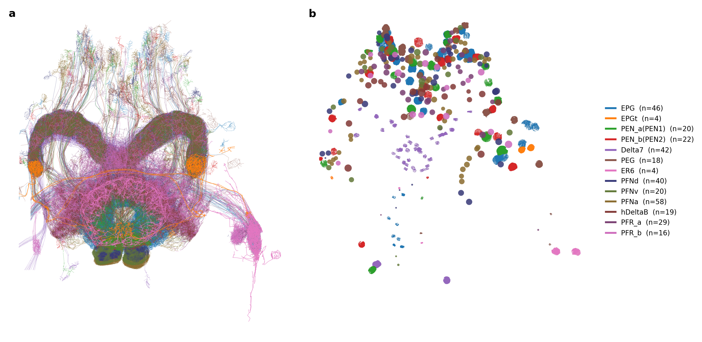
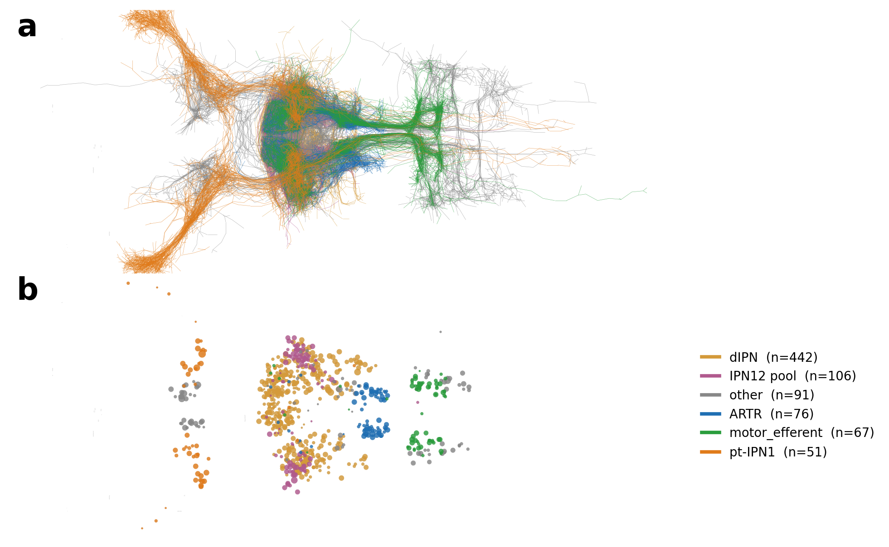

::: {.lead}
Two distant brains solve the same problem. As an animal turns, a single bump of
activity travels around a recurrently connected population of neurons and tracks
where the animal is facing — an internal compass built by *path integration* of
angular velocity. This **ring-attractor** computation has been described in the
*Drosophila* central complex and, more recently, in the larval-zebrafish
anterior hindbrain. Both circuits now exist as single-neuron connectomes, which
lets us ask a question that emergent-structure theory almost never gets to ask
against ground truth: **when a network is trained to perform heading
integration on a *known* connectome, what does the optimisation actually
identify?**
:::

This website is the companion to two manuscripts that share one method and one
conclusion. We take a connectome, lock each synapse to its anatomical sign
(Dale's law) and topology, and train constrained recurrent (RNN) and
message-passing graph (GNN) models on the path-/swim-integration task under
cross-validation. The result is the same in fly and fish:

> **The computation is identifiable, the implementation is not.** Optimising the
> input–output map reliably recovers the ring-attractor — a sharp travelling
> bump that integrates angular velocity into heading — but it does **not** pin
> down a unique circuit. Many connectome-consistent weight matrices, and even
> qualitatively different per-neuron dynamics, integrate heading equally well.
> Resolving these degeneracies requires going beyond the task: demanding
> consistency between connectome, *measured neural activity*, and behaviour.

## What's inside

- **[*Drosophila* CX — Circuit & Models](drosophila-cx.qmd)** — the 156-neuron
  central complex, the four constrained parameterisations (Known-ODE RNN,
  frozen-connectome control, fully connected RNN, message-passing GNN), the
  10-fold cross-validation summary, and what a trained ring attractor looks
  like in activity and in 3-D.
- **[*Drosophila* CX — Identifiability](drosophila-degeneracy.qmd)** — how
  tightly the task constrains the recurrent weights, where the head-direction
  information lives across cell types, the four functional classes (R/L/D/Z),
  tuning sharpness, and a direct analysis of the degeneracy of the inverse
  problem.
- **[Zebrafish dIPN](zebrafish.qmd)** — a vertebrate ring attractor at
  single-neuron resolution in the dorsal interpeduncular nucleus, the two
  Dale-sign hypotheses, and the key new ingredient: a **calcium-observation
  loss** that confronts the task-only model with the real ZAPBench recording
  and begins to break the degeneracy.

## The two substrates

::: {layout-ncol=2}

:::

The fly study pairs the Hulse et al. (2021) connectome with the Vafidis et al.
(2022) ring-attractor model; the fish study builds on Petrucco et al. (2023) and
the ZAPBench whole-brain calcium recording. Methods, equations, and all numbers
on the following pages are condensed faithfully from the source manuscripts.
