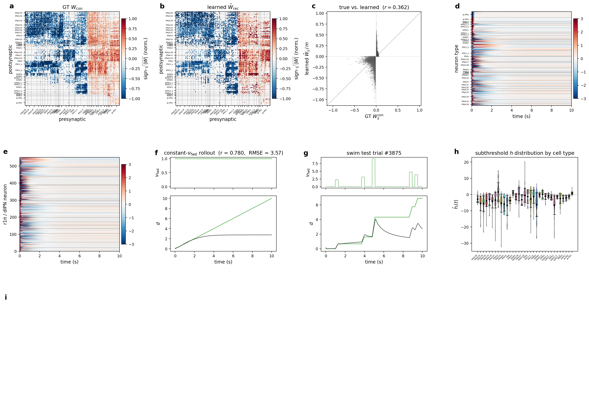
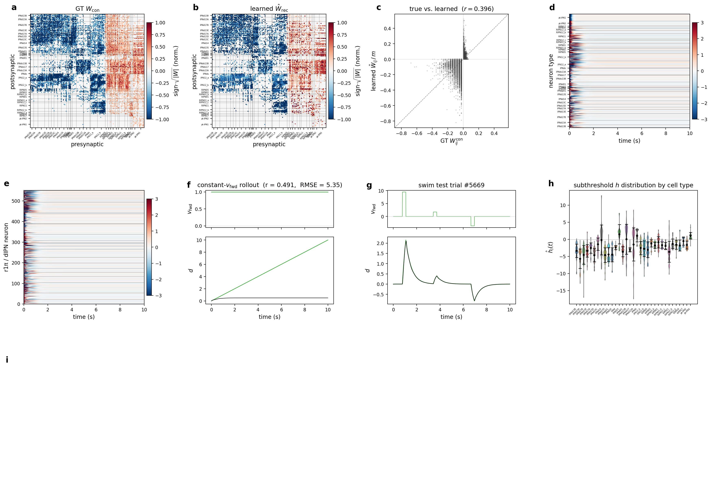
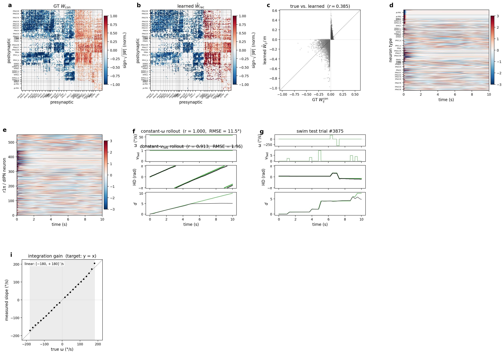
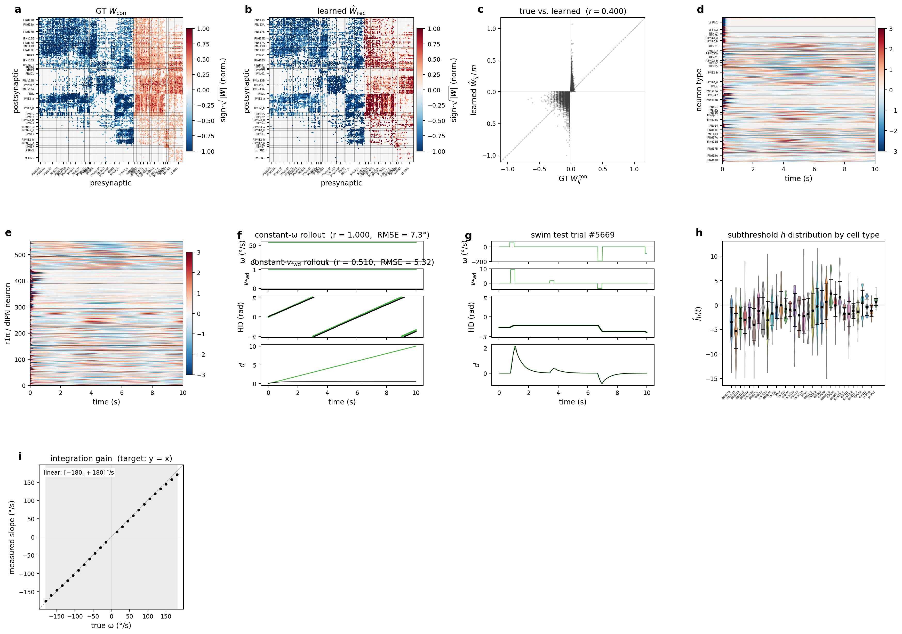
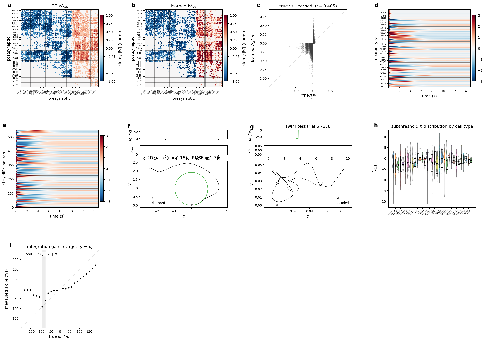
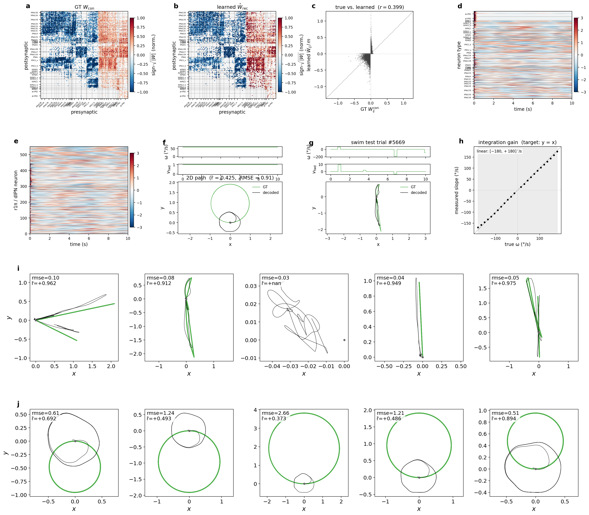

> **Abstract.** We study a vertebrate self-motion integrator at single-neuron
> resolution — the GABAergic r1π population of the larval-zebrafish anterior
> hindbrain (Petrucco et al. 2023), together with the three afferent
> populations the *fish2* inventory identifies as carrying its angular and
> translational drives. From the *neuprint-fish2* EM reconstruction we build
> sign-locked recurrent (RNN) and message-passing (GNN) models whose
> connectivity is fixed to the connectome under an all-inhibitory Dale
> convention, and train the **same** circuit on three progressively harder
> integration sub-tasks: **heading**, **heading + forward distance**, and
> **2-D path integration** with a dual exteroceptive + proprioceptive
> translation afferent. Optimising the input–output map alone recovers a sharp
> heading code, but the preferred-heading map is not anatomically organised and
> many connectome-consistent circuits integrate equally well, so the
> implementation is degenerate. The task-only model's population activity is
> also far from the measured ZAPBench calcium; adding a **calcium-observation
> loss** raises the predicted-vs-recorded per-neuron correlation from
> $\rho\approx0.06$ to $0.4$–$0.55$ while leaving heading accurately decoded.
> Companion to the [central-complex study](drosophila-cx.qmd).

# Introduction

In the larval zebrafish, head-direction information is carried by a population
of hundreds of GABAergic inhibitory neurons (the r1π cells) in rhombomere 1 of
the anterior hindbrain. A sinusoidal activity peak travels around the
**functional** ring — cells ordered by preferred heading, not by anatomical
position — opposite to the fish's swims, persists for tens of seconds without
motor activity, and tracks an estimated heading whose per-swim magnitude
(≈ π/4 rad) matches the behavioural turn. The supporting connectivity is the
classical ring-attractor architecture, and EM reconstructions of the r1π axons
reveal the reciprocal connectivity in the dorsal interpeduncular nucleus (dIPN)
consistent with it.

# Anatomy, functions and connectome

A **six-way functional partition** organises the circuit: the recurrent ring
substrate (**dIPN**, 443 cells) and the **IPN12 pool** (108 cells); the three
afferent populations the velocity gate routes drives through — **ARTR**
(76 cells, angular drive), **pt-IPN1** (51 cells, exteroceptive translation),
and **motor-efferent** (68 cells, proprioceptive translation); and a residual
**other** category (93 cells) not routed through the gate. Spatially the dIPN
substrate forms the compact midline neuropil; ARTR-derived afferents descend
from the habenula and pt-IPN-derived afferents sweep in from the lateral
pretectum. Together these make up the **839-cell** circuit.

![**Zebrafish HD / IPN circuit — anatomy (a, b) and afferent partition (c, d).** Six-way colour code shared across panels: dIPN (amber, $n=443$; ring substrate), IPN12 pool (rose, $n=108$; recurrent), ARTR (blue, $n=76$; angular afferent), pt-IPN1 (orange, $n=51$; exteroceptive translation), motor-efferent (green, $n=68$; proprioceptive translation), other (grey, $n=93$). (a) Full skeletons against the habenula / dIPN / vIPN ROI silhouettes, dorsal view. (b) The same neurons restricted to cell bodies — spatially disjoint from (a): the dense central region of (a) is the dIPN neuropil (no somata), the cell bodies sit in the surrounding cortex. (c) Velocity-gate partition: $\omega$ routed exclusively to ARTR and the exteroceptive forward channel $v_{\mathrm{ext}}$ routed exclusively to pt-IPN1 — rotation and translation paths are anatomically separated. (d) Proprioception extension: a separate proprioceptive forward channel $v_{\mathrm{prop}}$ is delivered through the motor-efferent cells in parallel with $v_{\mathrm{ext}}$, modelling sensory plus efference-copy redundancy. The recurrent network and decoder are identical between (c) and (d).](figures/zebrafish/fig_1_overview.png)

**Two forward pathways.** Forward-swim velocity reaches the IPN through an
*exteroceptive* channel via pt-IPN1 (optic / lateral-line flow — delayed but
self-calibrating) and a *proprioceptive* channel via the motor-efferent cells
(efference copy of the swim command — prompt but open-loop). The proprioception
variant adds the motor-efferent cells as a third gate target, with the forward
drive plumbed through both ports in parallel; the connectome is unchanged.

**Connectome.** The signed template is sparse — density 0.032, **22 425**
non-zero edges out of $839^2$. The r1π cells are GABAergic; their outgoing
weights are sign-flipped and amplified 5×, and the matrix is rescaled so the
leading eigenvalue has real part 0.9. Because it is unknown whether the IPN12
cells are GABAergic or glutamatergic, two sign variants are built from the
*same* topology: **v1** (IPN12 inhibitory) and **v2** (IPN12 excitatory). The
support is identical across variants — only the **3 536** IPN12 outgoing edges
change sign, moving the excitatory/inhibitory balance from 44.7 / 55.3% (v1) to
60.5 / 39.5% (v2).

![**Zebrafish HD / IPN connectome** ($839\times839$, 22 425 non-zero edges, density 0.032). All panels share the row/column ordering — neurons sorted by the six-way functional partition of the figure above, so each block sits at the same matrix coordinates. (a) Support mask, with colour-coded partition strips on the axes. (b) Signed $W^{\mathrm{con}}$ for v1 (IPN12 inhibitory), z-scored. (c) Signed $W^{\mathrm{con}}$ for v2 (IPN12 excitatory), same scale. The support is identical across variants; only the 3 536 IPN12 outgoing edges change sign.](figures/zebrafish/fig_2_connectome.png)

# Methods

## Sign-locked RNN

A sign-locked discrete-time RNN whose connectivity is fixed to the connectome
template, sigmoid activation $\sigma$, $\tau=0.1\,$s, $\Delta t=0.01\,$s. The
recurrent matrix keeps the connectome's sign pattern; only the per-edge
magnitude $\hat S$ is trainable:

$$
\tau\,\frac{d\hat h_i(t)}{dt} = -\hat h_i(t)
  + \sum_j \hat W^{\mathrm{rec}}_{ij}\,\sigma\big(\hat h_j(t)\big)
  + \sum_l \hat W^{\mathrm{in}}_{il}\,u_l(t) + \hat b_i,
\qquad
\hat W^{\mathrm{rec}}_{ij} = |\hat S_{ij}|\,\operatorname{sign}(W^{\mathrm{con}}_{ij}).
$$

The ring cells receive no external input; drive enters only through the
afferent gate and heading is read out from the ring.

## Anatomically licensed afferent ports

What enters the network is fixed by the afferent partition: each channel may
drive **only** its anatomically licensed subpopulation, and the ring cells stay
input-free. Angular velocity $\omega$ routes to ARTR; the forward drive routes
to pt-IPN1 (exteroceptive). The **proprioception** variant has *two* separate
input columns for forward swim — one to pt-IPN1, one to the motor-efferent
cells — so the two pathways are anatomically and parameterically independent.
In the first version both carry the same forward signal,
$v_{\mathrm{ext}}=v_{\mathrm{prop}}=v_{\mathrm{fwd}}$, plumbed through two
distinct ports. Directional channels are initialised antisymmetrically across
hemispheres so left and right drive the bump in opposite directions; the gates
are then free to retune — anatomy fixes *which port* a modality uses, not the
strength or sign it settles on.

## Task-conditioned readout

The readout reads from the ring (never the afferents). Its column count is set
by the active sub-task:

$$
\hat y(t) =
\begin{cases}
(\cos\hat\theta,\sin\hat\theta)               & \text{heading only},\\
(\cos\hat\theta,\sin\hat\theta,\hat d)        & \text{heading + forward distance},\\
(\cos\hat\theta,\sin\hat\theta,\hat x,\hat y) & \text{2-D path integration},
\end{cases}
$$

with $\hat\theta=\operatorname{atan2}(\hat y_2,\hat y_1)$.

## Swim-integration task: leaky vs cumulative targets

A single on-disk superset supplies every sub-task. Swim events are Poisson
(0.5 Hz, 0.3 s duration) in four categories L : R : F : B = 0.3 : 0.3 : 0.2 : 0.2;
left/right events drive a signed angular impulse, forward/backward a signed
forward-velocity impulse. The initial heading is injected as a single-frame cue
at $t=0$; position starts at the origin by construction. The default scalar
distance and 2-D position are **cumulative** integrators of their drives, which
grow linearly with the horizon. A finite time constant replaces the cumulative
sum with a **leaky** recurrence — for the 2-D target,

$$
\frac{dx}{dt} = -\frac{x}{\tau_p} + v_{\mathrm{fwd}}\cos\theta,
\qquad
\frac{dy}{dt} = -\frac{y}{\tau_p} + v_{\mathrm{fwd}}\sin\theta,
\qquad x(0)=y(0)=0,
$$

which keeps the trajectory bounded near the recent egocentric displacement — the
biologically natural choice (real integrators leak). Production runs use
$\tau_d=\tau_p=0.5\,$s, with cumulative recipes kept as separate variants.

![**Swim-integration task: input, scalar-distance target, and 2-D trajectory for one trial.** (a) Four-channel input: $\omega$, $v_{\mathrm{ext}}$, and the single-frame initial-heading impulse $(\cos\theta_0,\sin\theta_0)$. (b) Scalar-distance target: $\cos\theta$, $\sin\theta$, and forward distance $d$ — perfect cumulative integrator (green) vs leaky $\tau_d=0.5\,$s (red dashed). (c) The same trial's 2-D trajectory: the cumulative path drifts unboundedly from the origin while the leaky path's radius is bounded.](figures/zebrafish/fig_3_swim_task.png)

Training optimises a per-frame heading/target MSE plus two connectome-prior
regularisers (a per-type-pair cosine anchor and a norm-floor that stops any
block collapsing to zero) and $\ell_1$ sparsity on the recurrent magnitudes.

## Calcium-observation loss

An optional term matches predicted calcium to the recording. Per-neuron
activity is turned into fluorescence by a causal difference-of-exponentials
GCaMP7f kernel; both signals are z-scored over time (indicator gain/baseline are
non-identifiable), so for unit-variance signals the loss is
$\mathcal{L}_{\mathrm{obs}}=2(1-\rho)$ — it rewards **temporal shape**:

$$
k_{\mathrm{GCaMP}}(t)\propto e^{-t/\tau_d}-e^{-t/\tau_r},
\quad
\hat c_i = k_{\mathrm{GCaMP}} * \hat h_i,
\qquad
\mathcal{L}_{\mathrm{obs}} = \frac{1}{|\mathcal{O}|B_cT}\sum_{i\in\mathcal{O}}\sum_{b,t}
\big(z[\hat c_i]_{b,t} - z[c^\star_i]_{b,t}\big)^2 .
$$

The total objective adds $\lambda_{\mathrm{obs}}\mathcal{L}_{\mathrm{obs}}$;
$\lambda_{\mathrm{obs}}=0$ recovers the task-only model. Of the 839 circuit
neurons, **481** carry a matched ZAPBench recording (300 ring-pool + 181
afferents). Supervision uses the **Rotations** block — a 45°/s drifting grating,
~600 s — so the model is driven by the *same* stimulus that produced the
recording.

## Message-passing GNN

As in the fly, the GNN replaces the dense operator with message passing and does
**not** hard-code the leak, firing-rate nonlinearity or synaptic activation —
these emerge from a learned drift $f_\theta$, a learned signalling function
$g_\phi$ (constrained monotone in the presynaptic voltage), and a per-neuron
embedding $\mathbf a_i$, under the same per-edge sign-lock:

$$
\tau\,\frac{d\hat h_i(t)}{dt} =
  f_\theta\!\Big(\hat h_i,\,\mathbf a_i,\,
    \sum_{j\in\mathcal N_i} \hat W_{ij}\,g_\phi\big(\hat h_j,\mathbf a_j\big)\Big)
  + \sum_l \hat W^{\mathrm{in}}_{il}\,u_l(t).
$$

Hyperparameters are tuned by the agentic loop, scored by the 1 000-step rollout
correlation $r_{\mathrm{roll},1k}$.

# Results

## A trained heading integrator on the ARTR / pt-IPN1 circuit

Trained on the rotation-only sub-task — $\omega$ routed exclusively to ARTR,
forward swim to pt-IPN1 — the sign-locked RNN recovers the heading code. On the
full 10 000-trial test set the per-frame heading accuracy is 0.998, with a mean
per-trial circular RMSE of **3.6° ± 2.4°** (Pearson $r=0.995±0.042$). Across
four constant-$\omega$ deterministic rollouts (±60, ±120°/s) the circular RMSE
averages ≈ 18°, and the integration gain is **1.021 ± 0.020** — near-unit slope
across the full ±180°/s range. The dIPN carries a single travelling ring
activity peak. The learned per-edge magnitudes sit on the signed connectome
support by construction and correlate with the template at $r=0.377$.

![**Trained heading integrator on the ARTR / pt-IPN1 circuit** (sign-locked RNN, 839-cell circuit, IPN12 inhibitory; rotation-only task). (a) GT connectome and (b) learned $\hat W^{\mathrm{rec}}$, signed (red excitatory, blue inhibitory). (c) Learned vs connectome per-edge weight (Pearson $r$ in title). (d) All 839 neurons over a constant-$\omega=+60°/$s rollout, z-scored. (e) The dIPN sub-population — the travelling ring activity. (f) Constant-$\omega$ and (g) held-out swim decoding (true heading green, decoded black). (h) Per-cell-type state distributions. (i) Integration gain: decoded-heading slope vs true $\omega$ over ±180°/s; dashed line $g=1$.](figures/zebrafish/fig_evolution_zebrafish_hd_si_ipn12_artr_pt1_selfmotion_rotation.png)

::: {.column-margin}
The 3-D voltage animations below — rendered from earlier swim-integration runs
on this circuit — show the activity peak migrating on the actual dIPN skeletons.
Shown for intuition.
:::

::: {layout-ncol=2}
::: {}
**Constant rotation** — the heading bump under a steady angular velocity, on the dIPN skeletons.

:::
::: {}
**Swim integration** — discrete swim impulses kick the bump around the ring.

:::
:::

::: {layout-ncol=2}
::: {}
**Single left swim** — a 0.3 s leftward bout displaces the bump in one direction.

:::
::: {}
**Single right swim** — the mirror-image rightward displacement.

:::
:::

## The same circuit across the sub-task curriculum

The same 839-cell circuit trains successfully on every projection of the
swim-integration superset — only the readout columns (and, where applicable, the
leaky time constant) change; the gate, connectome and recurrent dynamics are
fixed. The compass behaviour is robust to task complexity: adding
forward-distance or 2-D-position regression alongside heading does not degrade
the constant-$\omega$ integration gain.

| Variant | $r_\theta$ (heading) | $r_d$ (distance) | $\bar r_{xy}$ (2-D) | $T_{\mathrm{follow}}$ (s) |
|---|---|---|---|---|
| Heading | 0.998 ± 0.023 | — | — | — |
| Distance (cumulative) | — | 0.995 ± 0.034 | — | 8.6 ± 2.7 |
| Distance (leaky) | — | 0.998 ± 0.022 | — | 2.5 ± 0.0 |
| Heading + distance (cumulative) | 0.995 ± 0.035 | 0.989 ± 0.053 | — | 7.3 ± 2.7 |
| Heading + distance (leaky) | 0.997 ± 0.033 | 0.997 ± 0.027 | — | 2.5 ± 0.0 |
| 2-D path (cumulative) | — | — | 0.760 ± 0.268 | — |
| 2-D path (leaky) | — | — | 0.945 ± 0.152 | — |

: Per-trial Pearson $r$ (mean ± SD over 10 000 held-out trials) plus the cumulative-distance tracking time $T_{\mathrm{follow}}$. The leaky variants saturate at $\tau\,v_{\mathrm{fwd}}$ so they match a sustained drive only over ~2.5 s by construction; the cumulative variants extrapolate further before the integrator falls behind. The 2-D path is the hardest target — $\bar r_{xy}$ jumps from 0.76 (cumulative) to 0.94 (leaky). {tbl-colwidths="[34,18,16,16,16]"}

**Translation only.** Both cumulative and leaky variants integrate forward
distance well on natural trials (leaky $r=0.999$) but **fail to extrapolate** to
a sustained constant drive the model never saw in training: the decoded distance
grows orders of magnitude more slowly than the target. Heading is not supervised
here, so the recurrent dynamics lose the absolute-distance anchor and the
integration-gain panel is left blank.

**Rotation + scalar distance.** Per-frame test R² ≥ 0.9998 on both heading and
distance. Strikingly, the **leaky-target supervision produces a sharper compass**
(constant-$\omega$ RMSE 8.1°, slope 0.99) than the cumulative version (33.1°),
comparable to the rotation-only model. The scalar-distance head shows the same
constant-drive extrapolation limit as the translation-only runs — confirming the
limit is task-, not input-, dependent.

**2-D path integration.** The full task ($\dot x = v_{\mathrm{fwd}}\cos\theta$,
$\dot y = v_{\mathrm{fwd}}\sin\theta$) still recovers heading at R² ≥ 0.994. The
2-D-position head is the harder regression — the **leaky target halves** the
trajectory error (per-frame Euclidean RMSE 0.98 vs 2.10; endpoint error 1.78 vs
3.72). Panels (f–g) show the decoded $(x,y)$ as a 2-D path rather than a time
trace.

## Angular / displacement partition of the recurrent pool

The joint-target variants let us ask which **recurrent** neurons carry which
target. Restricting to the recurrent pool (dIPN + IPN12, $n=551$; afferents are
excluded since their MI on the integrated quantity is trivially high), each cell
gets a per-neuron MI on heading and on forward distance, and a median split on
each axis assigns it to *angular*, *displacement*, *shared*, or *neither*. On
the leaky 2-D checkpoint this gives **34 / 34 / 242 / 241** — a dominant
**shared** population with small target-specialised tails. This partition
replaces the earlier R/L/D/Z labelling: it is target-symmetric, restricted to
the cells that actually integrate, and uses only model activity.

The recurrent→recurrent edge-block matrix is **not block-diagonal**: the
within-pool diagonals (angular→angular 0.82, displacement→displacement 1.20) are
comparable to the cross-pool angular↔displacement entries (0.76 / 0.65), and the
shared pool exchanges substantial weight with both endpoints. Integrated heading
and integrated distance are therefore **not** computed on disjoint sub-circuits —
the two codes ride overlapping recurrent neurons connected by edges of similar
magnitude across the partition.

![**MI-based partition of the recurrent pool and edge-block analysis** (leaky 2-D path variant; MI from 64 held-out trials). (a) Per-recurrent-neuron MI on heading vs MI on forward distance, $n=551$; dashed lines are the median thresholds, colours mark the four quadrants (angular blue, displacement orange, shared green, neither grey). Afferents excluded. (b) Mean magnitude $\langle|\hat W^{\mathrm{rec}}_{p\to q}|\rangle$ on recurrent→recurrent edges between the three task-aligned pools (rows = post, columns = pre). The matrix is not block-diagonal — the two integrations are distributed across overlapping micro-circuits, not disjoint sub-populations.](figures/zebrafish/fig_zebrafish_mi_partition.png)

## Task ability does not imply realistic activity

Here the task-only model meets the recording. Driven by the recorded ZAPBench
Rotations stimulus and rendered to GCaMP7f, the baseline is an excellent heading
*predictor* — yet its population activity is plainly **not** the recorded one:
clean stimulus-locked bands vs the irregular, bursty, drift-laden recording.
This is the degeneracy at the heart of the work, now read out on real data:
*many circuits realise the same heading computation, hence the same task
ability, while producing different activity*. Task supervision constrains only
the low-dimensional readout; the $N$-dimensional state it leaves unobserved is
exactly where implementations diverge.

Is the mismatch merely cosmetic — does the recording still encode heading in a
form the eye misses? A decoder trained on the recorded per-frame ΔF/F **cannot**
track heading, in sharp contrast to the model's own readout. A control settles
how much of this is the *observable* rather than the brain: the **same** decoder
applied to the model pushed through the **same** observation pipeline drops from
$r=0.97$ (latent readout) to $0.73$ (GCaMP-convolved, imaging-sampled, 300-cell
observable), while real data sits at $r=0.14$. The observation pipeline is a
**major but not sole** cause — a circuit encoding heading as cleanly as the model
would still decode at ≈ 0.73 under the recording's observation. **Heading lives
in the temporal dynamics, not in any single calcium frame** — which is why the
observation loss matches each neuron's time-course rather than asking the
activity to decode heading frame by frame.

![**Task-only model: accurate heading, unrealistic activity.** Baseline driven by the recorded Rotations stimulus, rendered to GCaMP7f. (a) Recorded ΔF/F for 300 matched ring-pool neurons (ZAPBench rastermap order); bottom strip: true heading (green) vs heading decoded from the recording (black), which fails to track. (b) The model's predicted calcium for the same neurons in the same row order — clean stimulus-locked banding, decoded heading tracks well. (c) First-100 s zoom. (d) Per-neuron power spectrum (median ± IQR): the model's energy concentrates at the rotation drive and its harmonics; the recording carries broad-band power away from those bins.](figures/zebrafish/fig_zebrafish_calcium_baseline.png)

## Signals not yet accounted for: the fish's own behaviour

The only time-varying input is the angular-velocity drive — an essentially
periodic ±45°/s square wave — and a deterministic circuit driven periodically
can only produce periodic output. The recording, by contrast, is conspicuously
**non-periodic** across the 600 s block. Laying the covariates side by side makes
the missing signals explicit: the fish's own *turning* is largely stimulus-locked
($\rho\approx0.76$, optomotor following) and a stimulus-driven model could in
principle capture it, but its *forward* drive is a slow, non-periodic latent
(lag-one autocorrelation ≈ 0.97, near-uncorrelated with the stimulus) that
drifts on the very timescale dominating the recurrent pool's irregular activity —
yet nothing in the stimulus carries it. These are not identifiability failures;
they are *inputs the network was never given*.

![**Signals present in the recording but not given to the model**, over the Rotations block (~600 s, shared time axis). Top to bottom: the periodic angular-velocity drive (the model's only input), its integrated heading, the stimulus direction; the fish's **forward** (slow, stimulus-independent drift) and **turning** (stimulus-locked) swim decodes; the raw L/R tail-EMG channels; and the recorded 300-neuron ring-pool ΔF/F in two orderings (rastermap and preferred-heading sort). The aperiodic structure tracks the behavioural drive but has no counterpart in the periodic stimulus, bounding the calcium reconstruction from above.](figures/zebrafish/fig_zebrafish_rotation_covariates.png)

## The calcium-observation loss partially closes the gap

Training the 839-cell circuit on swim integration while augmenting each
minibatch with recorded Rotations trials, and sweeping
$\lambda_{\mathrm{obs}}\in\{0,0.1,0.5,1,5\}$, the per-neuron temporal z-MSE
$2(1-\rho)$ **collapses as soon as the loss is on**. With $\lambda_{\mathrm{obs}}=0$
the task-only calcium is essentially uncorrelated with the recording (z-MSE ≈ 1.88,
$\rho\approx0.06$). Already at $\lambda_{\mathrm{obs}}=0.1$ the ring-pool z-MSE
drops to 1.25 ($\rho\approx0.38$) and the afferent pool to 0.92
($\rho\approx0.54$); larger weights buy little further reduction. The afferent
pool reconstructs markedly better than the ring throughout — it carries the
stimulus-locked part of the recording, while the ring activity is the irregular,
drift-laden component hardest to match. The fit is **partial**: the ring-pool
correlation plateaus near $\rho\approx0.4$, and large weights start to cost
heading accuracy — so $\lambda_{\mathrm{obs}}\approx0.1$–$0.5$ is the operating
point.

| $\lambda_{\mathrm{obs}}$ | ring z-MSE | ring SSIM | aff. z-MSE | aff. SSIM |
|---|---|---|---|---|
| 0 | 1.88 | **0.29** | 1.83 | 0.21 |
| 0.1 | 1.25 | 0.17 | 0.92 | **0.44** |
| 0.5 | **1.14** | 0.18 | 0.98 | 0.43 |
| 1.0 | 1.31 | 0.16 | 0.95 | 0.37 |
| 5.0 | 1.21 | 0.17 | **0.90** | 0.22 |

: Calcium-reconstruction quality vs observation weight, scored on a held-out continuous 600 s rollout against the recorded Rotations block. z-MSE $=2(1-\rho)$ (so 1.88 ↔ ρ ≈ 0.06, 0.90 ↔ ρ ≈ 0.55); SSIM is the kinograph structural-similarity index. Bold marks the best entry per column. Turning the loss on sharply reduces z-MSE and saturates; SSIM peaks at low weight; the afferent pool reconstructs better than the ring throughout. {tbl-colwidths="[18,18,18,18,18]"}

::: {.column-margin}
Reconstruction videos rendered from earlier observation-loss runs, for intuition.
:::

::: {layout-ncol=2}
::: {}
**dIPN HD ring** reconstruction.

:::
::: {}
**IPN12** reconstruction.

:::
:::

![**Calcium reconstruction with the observation loss on** ($\lambda_{\mathrm{obs}}=1$, rotation task). Driven by the held-out recorded Rotations stimulus (top: angular-velocity drive) and rendered to GCaMP7f. For the ring pool (300) and afferent pool, rows show recorded ΔF/F and the model's calcium under a continuous 600 s rollout, in matched rastermap order (per-panel z-MSE / SSIM inset). Bottom: true heading (green) vs readout-decoded heading (black). Relative to the task-only baseline the predicted calcium is now visibly banded in register — most clearly for the stimulus-locked afferents — while heading remains accurately decoded.](figures/zebrafish/fig_zebrafish_calcium_reconstruction.png)

The recipe is task-agnostic — the per-neuron shape loss never refers to heading
or distance — so it transfers to the other sub-tasks. Both companions below are
supervised against the same recorded Rotations block: the afferent pool
reconstructs at $\rho\approx0.4$ (SSIM 0.39–0.48), the ring pool at
$\rho\approx0.2$–0.3, and the task readouts stay accurately decoded — the
observation loss does not collapse onto the task heads.

# Outlook: one circuit, many tasks

The Rotations block is one of **nine** conditions in the same continuous
recording of the same 481 neurons; we have used only the 600 s rotation slice.
The contradiction — heading decodable from the readout at $\rho=0.97$ but from
the recording at $\rho=0.14$ — only arises if heading must live in the **raw**
per-neuron activity. It need not. If each cell carries a *mixture* of heading
$\theta(t)$ and a second behaviourally meaningful variable $d(t)$ roughly
orthogonal to heading, a *tuned* readout recovers $\theta$ cleanly while a
*naive* per-frame decoder, seeing $d$ as nuisance variance, cannot — two radio
stations on one wire. And if $d$ is slow and aperiodic, mixing it in makes the
population activity aperiodic, exactly the recorded signature a heading-only
model cannot produce. The second variable thus **resolves** the task/observation
tension instead of trading it off.

**Mask or mixed selectivity — a testable distinction.** The orthogonality lives
in the readout *weights*, not necessarily a partition of cells. In the
labelled-line case heading and $d$ occupy disjoint cell sets; in the
mixed-selectivity case the *same* cells carry both and the readouts are
orthogonal as weight vectors (e.g. $(1,1)$ and $(1,-1)$). Which holds is an
empirical question the recording answers with no model: score each recurrent
cell's heading tuning against its forward-swim weight — if those are largely
disjoint the second variable is a separate sub-population; if many single cells
score on **both**, it is genuinely multiplexed onto the heading cells.

**A multi-task objective.** The single heading readout becomes a set of
per-variable heads sharing the recurrent state — $k=\theta$ the heading head,
$k=d$ a self-motion head supervised by a leaky accumulator of the *measured*
forward-swim drive. Trained over the union of blocks (where heading and
self-motion decorrelate) and kept honest by generalisation to unseen blocks and
a phase-scrambled surrogate, it tests whether the connectome-locked circuit can
host several behaviourally meaningful variables at once. Because the second
target is computed from an **independent** signal (tail EMG), not inferred from
the calcium it must explain, it cannot absorb arbitrary structure the way a free
latent would.

![**The full ZAPBench session: nine conditions, one circuit** (~2 h, the same 481 neurons). Top: the per-frame stimulus-condition code. Middle: the fish's own **forward** and **turning** swim, available continuously in every block. Bottom: the recorded 300-neuron ring-pool ΔF/F (rastermap order). The ring activity changes character block to block — richly structured in Turning, Rotation and Flash, quiet in Darkness — so the blocks excite different axes of the latent code and their union constrains a far richer circuit than Rotation alone. Only the Rotation slice has been used so far.](figures/zebrafish/fig_zebrafish_all_blocks.png)

A per-block encoding diagnostic shows where it is worth wiring in more blocks:
**OMR Turning is the keystone** (the recurrent pool is most explainable there,
held-out $R^2=0.40$, and it is the longest block), and **forward-swim adds
significant, surrogate-beating variance** in Rotation, Flash, Taxis and Turning —
the second-variable signal is present across conditions, not an artefact of one
block. Several blocks (Gain, Position, Open-Loop, Darkness) are
near-unexplainable from the measured covariates — the quiet/latent regime.

![**Per-block encoding diagnostic.** Within each block the recorded ring-pool ΔF/F is regressed on the signals available everywhere — the stimulus-condition code and the forward/turning swim — with blocked-CV ridge and held-out $R^2$. (a) Held-out $R^2$, stimulus-only (grey) vs stimulus + swim (blue): most explainable in Turning (0.40), then Flash, Rotation, Taxis; Gain, Position, Open-Loop and Dark sit at or below zero. (b) Unique forward-swim variance $\Delta R^2$ per block vs a circular-shift surrogate null (± 2 SD); ∗ marks blocks where forward beats the null — Rotation, Flash, Taxis, Turning.](figures/zebrafish/fig_zebrafish_block_encoding.png)

# Outlook: which circuit properties are necessary?

Six directions follow directly from the experiments above and would convert this
existence proof into a structural account of the computation:

- **Is the connectome necessary?** Re-train the same task family on random
  networks matched for size, density and E/I, and on systematically rewired
  versions of the measured connectome, to isolate how much performance comes from
  the wiring versus raw capacity.
- **What E/I ratio supports joint heading + translation?** Sweep a controlled
  inhibitory fraction at constant density and re-fit, to find the window in which
  both heading and forward distance stay decodable, and where the measured ratio
  sits within it.
- **Minimum connectivity for path integration.** Prune edges in order of
  magnitude against the trained joint / 2-D models to find the sparsity floor,
  and whether integration degrades gracefully or fails at a cliff.
- **Specialised or mixed-selectivity coding?** A finer per-neuron MI analysis on
  heading, distance and their interaction — does the circuit converge on disjoint
  subpopulations or jointly-coding neurons, and does mixed selectivity emerge only
  when the task demands it?
- **How much does calcium supervision reduce degeneracy?** Compare the spread of
  learned weights and per-cell tuning across seeds with $\lambda_{\mathrm{obs}}=0$
  vs $>0$, to quantify the identifiability the observation loss adds.
- **Exteroceptive vs proprioceptive translation.** Ablate each forward pathway in
  turn at test time on the same trained circuit, to decompose the translation
  drive into its two physiologically distinct sources and predict which calcium
  signatures vanish under selective silencing.

# Appendix — cell-type vocabulary

| Role | Population | *fish2* prefix | $n$ | Sign / source |
|---|---|---|---|---|
| Recurrent (HD ring) | dorsal IPN (r1π) | *IPNd\** | 338 | inhibitory (Dale); r1π pop. of Petrucco et al. |
| Recurrent (HD ring, subset) | dorsal-subset IPN | *IPNds\** | 105 | inhibitory (Dale) |
| Recurrent (IPN12) | dorsal IPN | *IPN12_a/_b* | 108 | inh. (v1) / exc. (v2) |
| Angular afferent (ARTR) | habenula → IPN | *RIPN01/02/03_a/03_b* | 76 | ARTR, glutamatergic |
| Proprioceptive motor efferent | motor → IPN | *RIPN11/12_a/12_c* | 68 | efference-copy (our assignment) |
| Other RIPN | habenula → IPN | *RIPN05/12_b/16/17* | 56 | not gate-routed |
| Exteroceptive translation | pretectum → IPN | *pt-IPN1* | 51 | optic / water-flow (our assignment) |
| Other pretectal | pretectum → IPN | *pt-IPN2* | 37 | not gate-routed |

: HD-circuit cell-type families from the *fish2* reconstruction (total 839). *v1*/*v2* are the two IPN12 sign variants. The recurrent ring = *IPNd\** + *IPNds\** + IPN12 (551 cells); the gate-routed afferents are ARTR, motor-efferent and pt-IPN1. {tbl-colwidths="[26,22,22,8,22]"}

---

*Companion to the [Drosophila central-complex study](drosophila-cx.qmd). The
zebrafish HD circuit was reconstructed from neuPrint-fish2; calcium data from
ZAPBench. References: Petrucco et al. (2023), Nat. Neurosci. 26:765–773; Dana et
al. (2019), Nat. Methods 16:649–657; Dunn et al. (2016), eLife 5:e12741.*
